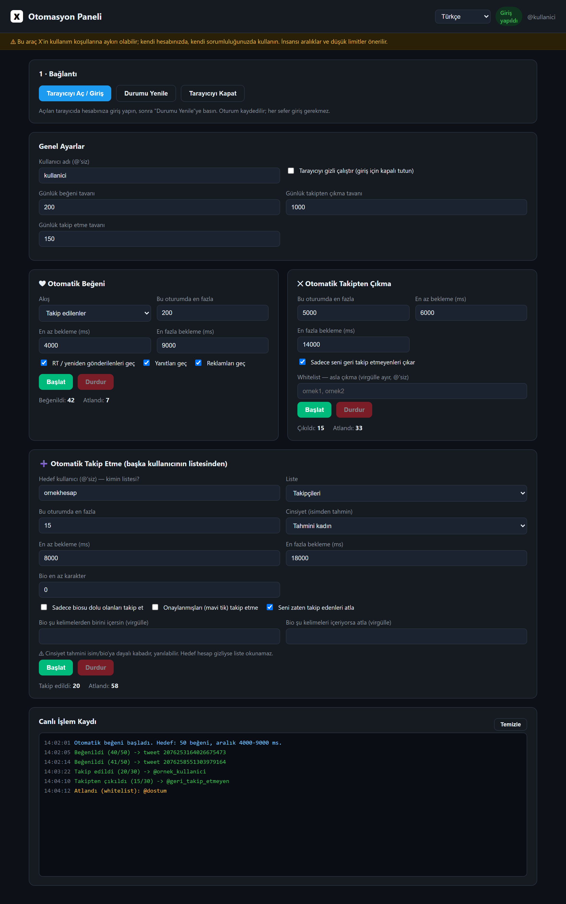
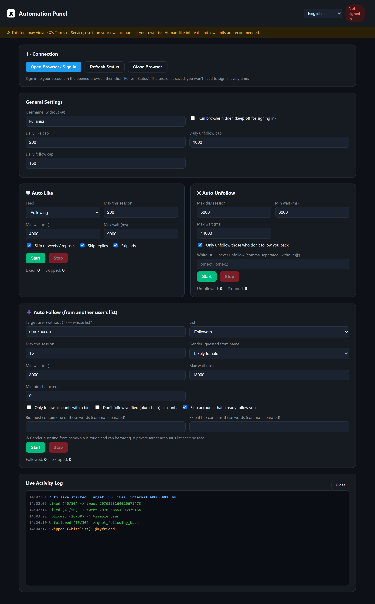

<div align="center">

# ❌ X Otomasyon Paneli · X Automation Panel

**Kendi X (Twitter) hesabınız için tarayıcı tabanlı otomasyon** — otomatik beğeni, geri takip etmeyenleri çıkarma ve filtreli takip etme.
_Browser-based automation for **your own** X (Twitter) account — auto-like, unfollow non-followers, and filtered follow._


</div>

---

<div align="center">

### 🇹🇷 Türkçe arayüz &nbsp;·&nbsp; 🇬🇧 English UI




</div>

---

## ✨ Özellikler / Features

| | TR | EN |
|---|---|---|
| ❤️ | **Otomatik beğeni** — akış filtreleri (RT/yanıt/reklam), ms aralık, oturum + günlük limit | **Auto-like** — feed filters (retweets/replies/ads), ms interval, session + daily cap |
| ✂️ | **Takipten çıkma** — seni geri takip etmeyenleri çıkar, whitelist, limitler | **Unfollow** — unfollow those who don't follow you back, whitelist, limits |
| ➕ | **Takip etme** — hedef hesabın listesinden filtreli takip (biosu dolu, mavi tik hariç, cinsiyet, kelime) | **Follow** — follow from a target's list with filters (has-bio, exclude verified, gender, keywords) |
| 🌍 | **6 dil** — arayüz, loglar ve cinsiyet tahmini seçilen dile göre | **6 languages** — UI, logs and gender guessing follow the selected language |
| 🖥️ | **Masaüstü + Web** — Electron penceresi veya tarayıcı | **Desktop + Web** — Electron window or browser |
| 🔑 | **API anahtarı gerekmez** — Playwright ile web arayüzünü sürer | **No API key** — drives the web UI via Playwright |

---

## ⚠️ Uyarı / Warning

**TR:** Otomatik beğeni ve toplu takip/takipten-çıkma, **X'in Kullanım Koşulları / Automation Rules kurallarına aykırıdır** ve kendi hesabınızda bile **askıya alınma riski** taşır. Kullanım tamamen sizin sorumluluğunuzdadır. Düşük limitler ve geniş, rastgele `ms` aralıkları önerilir. Cinsiyet tahmini isimden yapılır, **kesin değildir**.

**EN:** Auto-liking and bulk follow/unfollow **violate X's Terms of Service / Automation Rules** and can get your account **suspended**, even your own. Use entirely at your own risk. Low limits and wide, randomized `ms` intervals are recommended. Gender is guessed from the name and is **not accurate**.

---

## ⬇️ Hazır Kurulum / Ready-made Installer (Windows)

**TR:** Derlemekle uğraşmadan doğrudan kurmak için: **[X-Otomasyon-Setup-1.0.0.exe](release/X-Otomasyon-Setup-1.0.0.exe)** dosyasını indirip çalıştırın.
Windows SmartScreen uyarı verirse: **Ek bilgi → Yine de çalıştır**. (Uygulama imzasız olduğu için normaldir.)

**EN:** To install without building anything: download and run **[X-Otomasyon-Setup-1.0.0.exe](release/X-Otomasyon-Setup-1.0.0.exe)**.
If Windows SmartScreen warns: **More info → Run anyway**. (Normal, the app is unsigned.)

> **Not / Note:** Otomasyon için Playwright'ın Chromium'una ihtiyaç vardır; kaynaktan çalıştırıyorsanız `npx playwright install chromium` komutunu bir kez çalıştırın. / Automation needs Playwright's Chromium; if running from source, run `npx playwright install chromium` once.

---

## 🛠️ Kaynaktan Kurulum / Install from Source

**Gereksinim / Requirement:** [Node.js](https://nodejs.org) 18+

```bash
cd x-otomasyon
npm install
npx playwright install chromium   # otomasyon tarayıcısı / automation browser (bir kez / once)
```

### Çalıştırma / Running

```bash
npm run desktop     # 🖥️ Masaüstü uygulaması / Desktop app (Electron)
npm start           # 🌐 Web modu / Web mode -> http://localhost:4477
```

> Port: `PORT=5000 npm start`

### Kendi .exe'nizi üretme / Build your own .exe

```bash
npm run dist        # release/ klasörüne kurulum .exe'si üretir / builds an installer into release/
```

---

## 🚀 Kullanım / Usage

**TR:**
1. **Sağ üstten dili seçin** (TR/EN/DE/ES/FR/IT) — arayüz, loglar ve cinsiyet tahmini o dile geçer.
2. **"Tarayıcıyı Aç / Giriş"** → açılan Chromium'da hesabınıza giriş yapın (2FA/şifre elle). Oturum kaydedilir.
3. **"Durumu Yenile"** → giriş doğrulanır, kullanıcı adınız otomatik dolar.
4. Bir modülün ayarlarını yapıp **Başlat**'a basın; işlemleri **Canlı İşlem Kaydı**'ndan izleyin. İstediğiniz an **Durdur**.

**EN:**
1. **Pick a language** (top-right: TR/EN/DE/ES/FR/IT) — UI, logs and gender guessing switch to it.
2. **"Open Browser / Sign In"** → sign in to your account in the opened Chromium (2FA/password manually). The session is saved.
3. **"Refresh Status"** → sign-in is verified and your username is auto-filled.
4. Configure a module and click **Start**; watch the **Live Activity Log**. **Stop** anytime.

---

## 📁 Proje Yapısı / Project Structure

```
x-otomasyon/
  electron-main.cjs   Masaüstü sarmalayıcı / desktop wrapper (Electron)
  server.js           Express + WebSocket sunucu / server
  src/
    state.js          Ayarlar, olaylar, sayaçlar, dil / settings, events, counters, language
    locales.js        Çeviriler — 6 dil / translations — 6 languages
    browser.js        Playwright kalıcı tarayıcı + giriş / persistent browser + login
    liker.js          Otomatik beğeni / auto like
    unfollower.js     Takipten çıkma / unfollow
    follower.js       Takip etme / follow
    names.js          İsimden cinsiyet tahmini / gender guess (gender-detection-from-name)
    utils.js          Rastgele/iptal edilebilir bekleme / delays
  public/             Pano arayüzü / dashboard UI (index.html, app.js, style.css)
  docs/               Ekran görüntüleri / screenshots
```

---

<div align="center">
<sub>Playwright · Express · WebSocket · Electron · gender-detection-from-name</sub>
</div>
